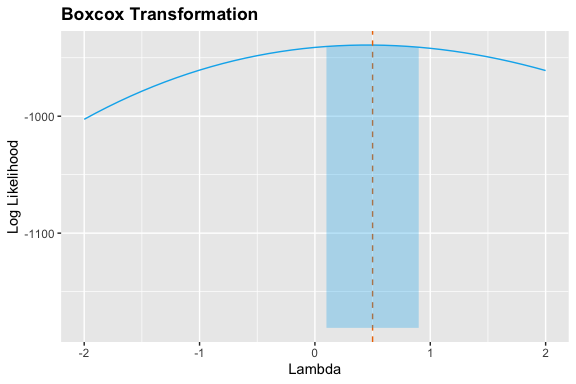

Time Series Analysis of Weather Data
================
Natalie Rozak
7/24/2020

I used a dataset about weather in Seattle from 1948 to 2020 from the
NOAA:
<https://www.ncdc.noaa.gov/cdo-web/datasets/GHCND/stations/GHCND:USW00024233/detail>.

``` r
# global imports
# data cleaning
library(tidyverse)
library(plyr)
library(MASS)
library(tseries)
# data visualization
library(kableExtra)
library(ggplot2)
library(gridExtra)
# modeling
library(forecast)

# surpress scientific notation
options(scipen=999)
```

# Preprocessing

``` r
# import data
daily <- read.csv('~/Documents/GitHub/R_TemperatureTimeSeries/seattle_data.csv',
                  header=TRUE)
# remove last data point
daily <- daily %>% filter(DATE!='2020-07-10')
# select columns
daily <- daily %>% subset(select=c(DATE,TMAX))
```

``` r
# output structure
str(daily)
```

    ## 'data.frame':    26489 obs. of  2 variables:
    ##  $ DATE: Factor w/ 26490 levels "1948-01-01","1948-01-02",..: 1 2 3 4 5 6 7 8 9 10 ...
    ##  $ TMAX: int  51 45 45 45 45 48 50 48 50 43 ...

``` r
# convert DATE to Date data type
daily$DATE <- as.Date(as.character(daily$DATE))
```

``` r
# output number of missing values in each column
kable(t(sapply(daily,function(x) sum(is.na(x))))) %>%
  kable_styling(bootstrap_options = c("striped", "hover", "condensed", "responsive"), 
                full_width=TRUE,position='center')
```

<table class="table table-striped table-hover table-condensed table-responsive" style="margin-left: auto; margin-right: auto;">

<thead>

<tr>

<th style="text-align:right;">

DATE

</th>

<th style="text-align:right;">

TMAX

</th>

</tr>

</thead>

<tbody>

<tr>

<td style="text-align:right;">

0

</td>

<td style="text-align:right;">

0

</td>

</tr>

</tbody>

</table>

``` r
# create monthly data
monthly <- daily
# create month and year variables
monthly$month <- lubridate::month(monthly$DATE)
monthly$year <- lubridate::year(monthly$DATE)
# group by month and year
monthly <- monthly %>% dplyr::group_by(year,month) %>%
  dplyr::summarize(AVG_TMP=mean(TMAX)) 
# create date column
monthly <- monthly %>% mutate(DATE=lubridate::make_date(year,month,1))
# select columns
monthly <- monthly %>% subset(select=c(DATE,AVG_TMP))
```

``` r
# make 70% of the data train and 30% of the data test
train_index <- 1:(0.7*nrow(monthly))
train <- monthly[train_index,]
test <- monthly[-train_index,]
```

``` r
# create time series object for train
train_ts <- ts(train$AVG_TMP,start=c(1948,1),frequency=12)
```

# Visualizations

***Time Series Plots***

``` r
# plot time series
ggplot() +
  geom_line(aes(x=train$DATE,y=train$AVG_TMP),color='deepskyblue2') +
  geom_line(aes(x=test$DATE,y=test$AVG_TMP),color='darkorange2') +
  labs(title='Time Series Plot of Temperature in Seattle') +
  ylab('Monthly Temperature (Fahrenheit)') +
  xlab('') +
  theme(plot.title=element_text(face='bold')) +
  stat_smooth(aes(x=train$DATE,y=train$AVG_TMP),color='maroon3',fill='maroon3',alpha=0.3)
```


***Decomposed Data***

``` r
# function for plotting time series
plot_time_series <- function(x,y,ylab) {
  ggplot() +
    geom_line(aes(x=x,y=y),color='deepskyblue2') +
    labs(title='Time Series Plot of Temperature in Seattle') +
    ylab(ylab) +
    xlab('') +
    theme(plot.title=element_text(face='bold')) +
    stat_smooth(aes(x=x,y=y),color='maroon3',fill='maroon3',alpha=0.3)
    
}
```

``` r
# decompose the data
comp <- decompose(train_ts)
# create graphs
trend <- plot_time_series(x=train$DATE,y=comp$trend,ylab='Trend')
seasonal <- plot_time_series(x=train$DATE,y=comp$seasonal,ylab='Seasonal')
random <- plot_time_series(x=train$DATE,y=comp$random,ylab='Random')
# arrange graphs
grid.arrange(trend,seasonal,random,nrow=3)
```


The time series seems to have a slightly increasing trend and a seasonal
effect with lag 12.

***Autocorrelation and Partial Autocorrelation Plots***

The autocovariance function is
=Cov(X_t,X_s)=E(X_tX_s)-E(X_t)E(X_s)"). The
autocorrelation function is
=Corr(X_t,X_s)=\\frac{Cov(X_t,X_s)}{\\sqrt{Var(X_1)Var(X_s)}}=\\frac{\\gamma_x(t,s)}{\\sigma_x(t)\\sigma_x(s)}").
For stationary data, this function is simplified to
=\\frac{\\gamma_x(k)}{\\gamma_x(0)}").

The partial autocorrelation function is
=1") and
=\\phi_{nn}"). The system of Yule-Walker equations
 is used to find the partial
autocorrelations:  & \\cdots & \\rho_x(n-1) \\\\ \\rho_x(1) & 1 & \\cdots & \\rho_x(n-2) \\\\ \\vdots & \\vdots & \\ddots & \\vdots & \\\\ \\rho_x(1) & \\rho_x(n-1) & \\cdots & 1 \\end{bmatrix} \\begin{bmatrix} \\phi_{n1} \\\\ \\phi_{n2} \\\\ \\vdots \\\\ \\phi_{nn} \\end{bmatrix} = \\begin{bmatrix} \\rho_x(1) \\\\ \\rho_x(2) \\\\ \\vdots \\\\ \\rho_x(n) \\end{bmatrix}")

The confidence intervals are estimated as
.

``` r
# function for plottig acf/pacf
plot_acf_pacf <- function(lag,func,n,alpha,title,ylab){
  ggplot() +
    geom_segment(aes(x=lag,y=0,xend=lag,yend=func),col='deepskyblue2') +
    geom_point(aes(x=lag,y=func),col='deepskyblue2') +
    geom_hline(yintercept=c(-1,1)*qnorm((1+alpha)/2)/sqrt(n),
               lty=2,col='darkorange2') +
    labs(title=title) +
    ylab(ylab) +
    xlab('Lag') +
    theme(plot.title=element_text(face='bold'))
}
```

``` r
# create acf data frame
train_acf <- acf(train_ts,lag.max=50,plot=FALSE)
# create graph
plot_acf_pacf(train_acf$lag,train_acf$acf,train_acf$n.used,
              0.95,'Autocorrelation Plot','ACF')
```


``` r
# create acf data frame
train_pacf <- pacf(train_ts,lag.max=50,plot=FALSE)
# create graph
plot_acf_pacf(train_pacf$lag,train_pacf$acf,train_pacf$n.used,
              0.95,'Partial Autocorrelation Plot','PACF')
```


# Stationary Data

Stationary data has a constant variance, no trend, and no seasonality.

## Stabilize Variance

Box-cox transformations are used to stabilize the variance. They are
defined as:  &\\text{if } \\lambda=0,y_i\\geq0 \\\\ \\frac{y^{\\lambda}-1}{\\lambda} &\\text{if } \\lambda\\neq0,y_i\\geq0 \\end{cases}").
The confidence interval for
 is
\\geq\\ell(\\hat\\lambda)-\\frac{1}{2}\\chi^2_{1,1-\\alpha}").

``` r
# find lambda
t <- 1:nrow(train)
lambdas <- boxcox(train_ts~t,plotit=FALSE)
# obtain best lambda
best_lambda <- lambdas$x[which(lambdas$y==max(lambdas$y))]
# create confidence interval
ci_lambda <- lambdas$x[lambdas$y > max(lambdas$y)-qchisq(0.95,1)/2]
lambdas_df <- data.frame(lambdas$x,lambdas$y) %>% 
  plyr::rename(c('lambdas.x'='x','lambdas.y'='y'))
# plot lambdas
ggplot() +
  geom_line(data=lambdas_df,aes(x=x,y=y),color='deepskyblue2') +
  geom_vline(xintercept=best_lambda,linetype='dashed',color='darkorange2')+
  geom_ribbon(data=subset(lambdas_df,x>=min(ci_lambda)&x<=max(ci_lambda)),
              aes(x=x,ymin=-1181,ymax=y),
            fill='deepskyblue2',alpha=0.3) +
  labs(title='Boxcox Transformation') +
  ylab('Log Likelihood') +
  xlab('Lambda') +
  theme(plot.title=element_text(face='bold'))
```



``` r
# output best lambda
cat('Best lambda: ',best_lambda,'\n')
```

    ## Best lambda:  0.5

``` r
# output confidence interval
cat('Lower bound of confidence interval: ',min(ci_lambda),'\n')
```

    ## Lower bound of confidence interval:  0.1

``` r
cat('Upper bound of confidence interval: ',max(ci_lambda),'\n')
```

    ## Upper bound of confidence interval:  0.9

Since the confidence interval for
 does not contain 1, a transformation is needed to
stabilize the variance. I transformed the data by using
 which takes the square root of the temperature values.

``` r
# transform the data
train_ts_bc = sqrt(train_ts)
```

## Test for Trend

The Dickey-Fuller test is used to determine if the data is
non-stationary due to a trend; the Kwiatkowski-Phillips-Schmidt-Shin
test is used to determine if the data is non-stationary without
differencing.

``` r
# adf test
adf <- adf.test(train_ts_bc,k=0)
if (adf$p.value<=0.05){
  cat('Reject null hypothesis for DF test: data is stationary.\n')
}else{
  cat('Fail to reject null hypothesis for DF test: data is not stationary\n')
}
```

    ## Reject null hypothesis for DF test: data is stationary.

``` r
# kpss test
kpss <- kpss.test(train_ts_bc)
if(kpss$p.value<=0.05){
  cat('Reject null hypothesis for KPSS test: data is not stationary.\n')
}else{
  cat('Fail to reject null hypothesis for KPSS test: data is stationary\n')
}
```

    ## Fail to reject null hypothesis for KPSS test: data is stationary

Since the data is stationary in both cases, there is no need to correct
for trend. When looking at the decomposed graph for trend, we see the
data does not have a smooth trend, so not differencing for a trend seems
reasonable.

## Remove Seasonality

I differenced once at lag 12 to remove seasonality:
X_t = X_t - X_{t-12}").

``` r
# data differenced at lag 1
diff_seas <- diff(train_ts_bc,lag=12,differences=1)
# adjust date
removed <- 1:(length(train_ts_bc)-length(diff_seas))
diff_seas_date <- train$DATE[-removed]
# create graph
plot_time_series(diff_seas_date,diff_seas,
                 '12th Difference of the Square Rooted Monthly Temperature')
```


The time series plot for the final data appears stationary, looking like
white noise.

``` r
# create acf data frame
diff_seas_acf <- acf(diff_seas,lag.max=50,plot=FALSE)
# create graph
plot_acf_pacf(diff_seas_acf$lag,diff_seas_acf$acf,diff_seas_acf$n.used,
              0.95,'Autocorrelation Plot','ACF')
```


``` r
# create acf data frame
diff_seas_pacf <- pacf(diff_seas,lag.max=85,plot=FALSE)
# create graph
plot_acf_pacf(diff_seas_pacf$lag,diff_seas_pacf$acf,diff_seas_pacf$n.used,
              0.95,'Partial Autocorrelation Plot','PACF')
```


# SARIMA Model

***Find Parameters***

Based off of the ACF and PACF plots, I suspect that the model parameters
are close to
SARIMA\\times(0,1,1)_{12}"). To choose the best model, I used grid
search to find the parameters that minimize Akaike Information Criterion
(AIC). The formula for AIC is
)+2k") where
") are the maximum
likelihood estimators and 
is the number of estimated parameters.

``` r
# output mean
cat('Mean of differenced time series: ',mean(diff_seas))
```

    ## Mean of differenced time series:  0.004784514

Since the mean is very close to 0, I will not include a constant term in
the model.

    # create vectors to try
    p_vec <- c(0:3,11)
    q_vec <- c(0:3)
    P_vec <- c(0:6)
    Q_vec <- c(0:1)
    # find best AICC
    AIC <- NULL
    for (p in p_vec){
      for (q in q_vec){
        for (P in P_vec){
          for (Q in Q_vec){
            model <- try(Arima(train_ts_bc,
                           order=c(p,0,q),
                           seasonal=list(order=c(P,1,Q),period=12),
                           method='CSS-ML',
                           optim.method='L-BFGS-B',
                           optim.control=list(maxit=500)),TRUE)
            if (isTRUE(class(model)=='try-error')){
              next
            }else{
              AIC <- rbind(AIC,c(p,q,P,Q,model$aic))
            }
          }
        }
      }
    }
    # rename columns
    colnames(AIC) <- c('p','q','P','Q','aic')
    # convert to data frame
    AIC_df <- as.data.frame(AIC)
    # output best AIC
    head(AIC_df[order(AIC_df$aic),])

***Find Coefficients***

``` r
# create final model
initial_model <- Arima(train_ts_bc,order=c(3,0,0),seasonal=list(order=c(2,1,1),period=12),
                       method='CSS-ML',optim.method='L-BFGS-B',optim.control=list(maxit=500))
```

``` r
# variance matrix for coefficients
initial_var_matrix <- vcov(initial_model)
# ar1
cat('The AR1 coefficient is: ',initial_model$coef[1],
    '.\n The lower bound for the confidence interval is: ',
    initial_model$coef[1]-1.96*sqrt(initial_var_matrix[1,1]),
    '.\n The upper bound for the confidence interval is: ',
    initial_model$coef[1]+1.96*sqrt(initial_var_matrix[1,1]),'.\n')
```

    ## The AR1 coefficient is:  0.2141707 .
    ##  The lower bound for the confidence interval is:  0.1340812 .
    ##  The upper bound for the confidence interval is:  0.2942603 .

``` r
# ar2
cat('The AR2 coefficient is: ',initial_model$coef[2],
    '.\n The lower bound for the confidence interval is: ',
    initial_model$coef[2]-1.96*sqrt(initial_var_matrix[2,2]),
    '.\n The upper bound for the confidence interval is: ',
    initial_model$coef[2]+1.96*sqrt(initial_var_matrix[2,2]),'.\n')
```

    ## The AR2 coefficient is:  0.03501449 .
    ##  The lower bound for the confidence interval is:  -0.04641285 .
    ##  The upper bound for the confidence interval is:  0.1164418 .

``` r
# ar3
cat('The AR3 coefficient is: ',initial_model$coef[3],
    '.\n The lower bound for the confidence interval is: ',
    initial_model$coef[3]-1.96*sqrt(initial_var_matrix[3,3]),
    '.\n The upper bound for the confidence interval is: ',
    initial_model$coef[3]+1.96*sqrt(initial_var_matrix[3,3]),'.\n')
```

    ## The AR3 coefficient is:  0.1326561 .
    ##  The lower bound for the confidence interval is:  0.05299425 .
    ##  The upper bound for the confidence interval is:  0.212318 .

``` r
# sar1
cat('The SAR1 coefficient is: ',initial_model$coef[4],
    '.\n The lower bound for the confidence interval is: ',
    initial_model$coef[4]-1.96*sqrt(initial_var_matrix[4,4]),
    '.\n The upper bound for the confidence interval is: ',
    initial_model$coef[4]+1.96*sqrt(initial_var_matrix[4,4]),'.\n')
```

    ## The SAR1 coefficient is:  0.009039933 .
    ##  The lower bound for the confidence interval is:  -0.08039054 .
    ##  The upper bound for the confidence interval is:  0.09847041 .

``` r
# sar2
cat('The SAR2 coefficient is: ',initial_model$coef[5],
    '.\n The lower bound for the confidence interval is: ',
    initial_model$coef[5]-1.96*sqrt(initial_var_matrix[5,5]),
    '.\n The upper bound for the confidence interval is: ',
    initial_model$coef[5]+1.96*sqrt(initial_var_matrix[5,5]),'.\n')
```

    ## The SAR2 coefficient is:  -0.1084561 .
    ##  The lower bound for the confidence interval is:  -0.1965959 .
    ##  The upper bound for the confidence interval is:  -0.02031642 .

``` r
# sma1
cat('The SMA1 coefficient is: ',initial_model$coef[6],
    '.\n The lower bound for the confidence interval is: ',
    initial_model$coef[6]-1.96*sqrt(initial_var_matrix[6,6]),
    '.\n The upper bound for the confidence interval is: ',
    initial_model$coef[6]+1.96*sqrt(initial_var_matrix[6,6]),'.\n')
```

    ## The SMA1 coefficient is:  -0.895276 .
    ##  The lower bound for the confidence interval is:  -0.9434434 .
    ##  The upper bound for the confidence interval is:  -0.8471087 .

The confidence interval for the AR2 and SAR1 coefficients contain 0 so I
will remove these terms from the final model.

***Final Model***

``` r
# create final model
sarima_model <- Arima(train_ts_bc,order=c(3,0,0),seasonal=list(order=c(2,1,1),period=12),
                      fixed=c(NA,0,NA,0,NA,NA),
                      method='CSS-ML',optim.method='L-BFGS-B',optim.control=list(maxit=500))
```

``` r
# variance matrix for coefficients
var_matrix <- vcov(sarima_model)
# ar1
cat('The AR1 coefficient is: ',sarima_model$coef[1],
    '.\n The lower bound for the confidence interval is: ',
    sarima_model$coef[1]-1.96*sqrt(var_matrix[1,1]),
    '.\n The upper bound for the confidence interval is: ',
    sarima_model$coef[1]+1.96*sqrt(var_matrix[1,1]),'.\n')
```

    ## The AR1 coefficient is:  0.2212857 .
    ##  The lower bound for the confidence interval is:  0.1429474 .
    ##  The upper bound for the confidence interval is:  0.2996239 .

``` r
# ar3
cat('The AR3 coefficient is: ',sarima_model$coef[3],
    '.\n The lower bound for the confidence interval is: ',
    sarima_model$coef[3]-1.96*sqrt(var_matrix[2,2]),
    '.\n The upper bound for the confidence interval is: ',
    sarima_model$coef[3]+1.96*sqrt(var_matrix[2,2]),'.\n')
```

    ## The AR3 coefficient is:  0.1400852 .
    ##  The lower bound for the confidence interval is:  0.06223115 .
    ##  The upper bound for the confidence interval is:  0.2179392 .

``` r
# sar2
cat('The SAR2 coefficient is: ',sarima_model$coef[5],
    '.\n The lower bound for the confidence interval is: ',
    sarima_model$coef[5]-1.96*sqrt(var_matrix[3,3]),
    '.\n The upper bound for the confidence interval is: ',
    sarima_model$coef[5]+1.96*sqrt(var_matrix[3,3]),'.\n')
```

    ## The SAR2 coefficient is:  -0.1102674 .
    ##  The lower bound for the confidence interval is:  -0.1970773 .
    ##  The upper bound for the confidence interval is:  -0.02345746 .

``` r
# sma1
cat('The SMA1 coefficient is: ',sarima_model$coef[6],
    '.\n The lower bound for the confidence interval is: ',
    sarima_model$coef[6]-1.96*sqrt(var_matrix[4,4]),
    '.\n The upper bound for the confidence interval is: ',
    sarima_model$coef[6]+1.96*sqrt(var_matrix[4,4]),'.\n')
```

    ## The SMA1 coefficient is:  -0.89213 .
    ##  The lower bound for the confidence interval is:  -0.9361439 .
    ##  The upper bound for the confidence interval is:  -0.8481161 .

The final model is
SARIMA\\times(2,1,1)_{12}") with
\\Phi(B^{12})(1-B^{12})X_t=\\Theta(B^{12})Z_t") with
=1-0.221B-0.14B^3"),
=1+0.11B^{24}"), and
=1-0.892B^{12}"). The solved equation is
.

``` r
# output the AIC for the final model
cat('The AIC for the final model is: ',sarima_model$aic,'\n')
```

    ## The AIC for the final model is:  -219.92

# Diagnostic Checking

## Residuals are White Noise

Residuals are .

``` r
# residuals
residuals <- residuals(sarima_model,standardized=FALSE)
# standardized residuals
standardized_residuals <- residuals(sarima_model,standardized=TRUE)
```

***Time Series Plot***

``` r
# plot standardized residuals
plot_time_series(train$DATE,standardized_residuals,'Standardized Residuals')
```


The time series plot of the residuals resembles white noise.

***ACF and PACF Plots***

``` r
# create acf data frame
resid_acf <- acf(residuals,lag.max=20,plot=FALSE)
# create graph
plot_acf_pacf(resid_acf$lag,resid_acf$acf,resid_acf$n.used,
              0.95,'Autocorrelation Plot','ACF')
```


``` r
# create acf data frame
resid_pacf <- pacf(residuals,lag.max=20,plot=FALSE)
# create graph
plot_acf_pacf(resid_pacf$lag,resid_pacf$acf,resid_pacf$n.used,
              0.95,'Partial Autocorrelation Plot','PACF')
```


Residuals are uncorrelated based on the ACF and PACF plots.

***Portmanteau Statistics***

Null hypothesis: residuals are uncorrelated. Alternative hypothesis:
residuals are correlated.

The Box-Pierce test for linear dependence uses test statistic
^2") where
 and
. The Ljung test for linear dependence uses test
statistic
\\sum_{j=1}^h\\frac{\\hat{\\rho}(j)^2}{n-j}") where
 and
. The Mcleod Li test for noninear dependence uses
test statistic
\\sum_{j=1}^h\\frac{\\hat{\\rho}_{\\hat{W}\\hat{W}}(j)^2}{n-j}")
where
,
=\\frac{\\sum_{t=1}^{n-h}(\\hat{W}_t^2-\\bar{W}^2)(\\hat{W}_{t+h}^2-\\bar{W}^2)}{\\sum_{t=1}^n(\\hat{W}_t^2-\\bar{W}^2)^2}"),
, and
.

``` r
h <- sqrt(length(train_ts_bc))
# Box-Pierce test
box_pierce <- Box.test(residuals,lag=h,type=c('Box-Pierce'),fitdf=7)
if (box_pierce$p.value<=0.05){
  cat('Reject null hypothesis for Box-Pierce test: residuals are correlated\n')
}else{
  cat('Fail to reject null hypothesis for Box-Pierce test: residuals are uncorrelated\n')
}
```

    ## Fail to reject null hypothesis for Box-Pierce test: residuals are uncorrelated

``` r
# Ljung test
ljung <- Box.test(residuals,lag=h,type=c('Ljung-Box'),fitdf=7)
if (ljung$p.value<=0.05){
  cat('Reject null hypothesis for Ljung test: residuals are correlated\n')
}else{
  cat('Fail to reject null hypothesis for Ljung test: residuals are uncorrelated\n')
}
```

    ## Fail to reject null hypothesis for Ljung test: residuals are uncorrelated

``` r
# Mcleod Li test
mcleod_li <- Box.test(residuals^2,lag=h,type=c('Ljung-Box'),fitdf=0)
if (mcleod_li$p.value<=0.05){
  cat('Reject null hypothesis for Mcleod Li test: residuals are correlated\n')
}else{
  cat('Fail to reject null hypothesis for Mcleod Li test: residuals are uncorrelated\n')
}
```

    ## Fail to reject null hypothesis for Mcleod Li test: residuals are uncorrelated

## Residuals are Normally Distributed

***Q-Q Plot***

``` r
# create qq plot
ggplot(data.frame(y=standardized_residuals),aes(sample=y)) +
  stat_qq_line(color='darkorange2') + stat_qq(color='deepskyblue2') +
  labs(title='Q-Q Plot of Standardized Residuals') +
  theme(plot.title=element_text(face='bold'))
```


The Q-Q plot is linear, indicating that residuals are normally
distributed.

***Shapiro-Wilk Test***

Null hypothesis: residuals follow a normal distribution. Alternative
hypothesis: residuals are not from a normal distribution.

``` r
# shapiro wilk test
shapiro <- shapiro.test(residuals)
if (shapiro$p.value<=0.05){
  cat('Reject null hypothesis for Shapiro-Wilk test: residuals are not normal\n')
}else{
  cat('Fail to reject null hypothesis for Shapiro-Wilk test: residuals are normal\n')
}
```

    ## Fail to reject null hypothesis for Shapiro-Wilk test: residuals are normal

# Forecasting

``` r
# obtain predictions
predictions <- predict(sarima_model,n.ahead=nrow(test))
# obtain confidence interval
pred_ci_lower <- predictions$pred - 1.96*predictions$se
pred_ci_upper <- predictions$pred + 1.96*predictions$se
```

``` r
# convert predictions back to original values
orig_pred <- predictions$pred^2
orig_pred_ci_lower <- pred_ci_lower^2
orig_pred_ci_upper <- pred_ci_upper^2
```

***Plot Predictions***

``` r
# plot time series
ggplot() +
  geom_line(aes(x=train$DATE,y=train$AVG_TMP),color='deepskyblue2') +
  geom_line(aes(x=test$DATE,y=orig_pred),color='darkorange2') +
  geom_ribbon(aes(x=test$DATE,ymin=orig_pred_ci_lower,ymax=orig_pred_ci_upper),
              fill='darkorange2',alpha=0.3) +
  labs(title='Time Series Plot of Temperature in Seattle with Forecasts') +
  ylab('Monthly Temperature (Fahrenheit)') +
  xlab('') +
  theme(plot.title=element_text(face='bold'))
```


``` r
# plot time series
ggplot() +
  geom_line(aes(x=test$DATE,y=orig_pred),color='darkorange2') +
  geom_ribbon(aes(x=test$DATE,ymin=orig_pred_ci_lower,ymax=orig_pred_ci_upper),
              fill='darkorange2',alpha=0.3) +
  labs(title='Time Series Plot of Forecasted Temperature in Seattle') +
  ylab('Monthly Temperature (Fahrenheit)') +
  xlab('') +
  theme(plot.title=element_text(face='bold'))
```


***Root Mean Squared Error***

``` r
# rmse function
rmse <- function(y,y_hat){
  return(sqrt(mean((y-y_hat)^2)))
}
```

``` r
# root mean squared error
cat('RMSE on the test data: ',rmse(test$AVG_TMP,orig_pred),'\n')
```

    ## RMSE on the test data:  2.825677
