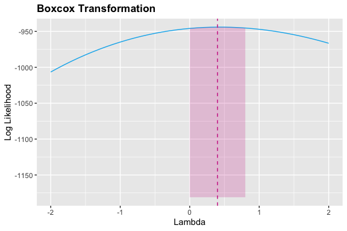

Time Series Analysis of Weather Data
================
Natalie Rozak
7/27/2020

I used a dataset about weather in Seattle from 1948 to 2020 from the
NOAA:
<https://www.ncdc.noaa.gov/cdo-web/datasets/GHCND/stations/GHCND:USW00024233/detail>.

``` r
# global imports
# data cleaning
library(tidyverse)
library(plyr)
library(MASS)
library(tseries)
# data visualization
library(kableExtra)
library(ggplot2)
library(gridExtra)
# modeling
library(forecast)
library(caret)
library(randomForest)
library(gbm)
library(glmnet)
library(e1071)
library(neuralnet)

# surpress scientific notation
options(scipen=999)
```

# Preprocessing

``` r
# import data
daily <- read.csv('~/Documents/GitHub/R_TemperatureTimeSeries/seattle_data.csv',
                  header=TRUE)
# select columns
daily <- daily %>% subset(select=c(DATE,TMAX))
```

``` r
# output structure
str(daily)
```

    ## 'data.frame':    26490 obs. of  2 variables:
    ##  $ DATE: Factor w/ 26490 levels "1948-01-01","1948-01-02",..: 1 2 3 4 5 6 7 8 9 10 ...
    ##  $ TMAX: int  51 45 45 45 45 48 50 48 50 43 ...

``` r
# convert DATE to Date data type
daily$DATE <- as.Date(as.character(daily$DATE))
# remove extra dates
daily <- daily %>% filter(DATE<'2020-01-01')
```

``` r
# output number of missing values in each column
kable(t(sapply(daily,function(x) sum(is.na(x))))) %>%
  kable_styling(bootstrap_options = c("striped", "hover", "condensed", "responsive"), 
                full_width=TRUE,position='center')
```

<table class="table table-striped table-hover table-condensed table-responsive" style="margin-left: auto; margin-right: auto;">

<thead>

<tr>

<th style="text-align:right;">

DATE

</th>

<th style="text-align:right;">

TMAX

</th>

</tr>

</thead>

<tbody>

<tr>

<td style="text-align:right;">

0

</td>

<td style="text-align:right;">

0

</td>

</tr>

</tbody>

</table>

``` r
# create monthly data
monthly <- daily
# create month and year variables
monthly$month <- lubridate::month(monthly$DATE)
monthly$year <- lubridate::year(monthly$DATE)
# group by month and year
monthly <- monthly %>% dplyr::group_by(year,month) %>%
  dplyr::summarize(AVG_TMP=mean(TMAX)) 
# create date column
monthly <- monthly %>% mutate(DATE=lubridate::make_date(year,month,1))
# select columns
monthly <- monthly %>% subset(select=c(DATE,AVG_TMP))
```

Training data is comprised of the first 51 years, the last 20 years are
used to test the models.

``` r
# split into train and test
train_index <- 1:624
train <- monthly[train_index,]
test <- monthly[-train_index,]
# remove extra rows from train 
train <- train[-(1:12),]
```

``` r
# create time series objects
train_ts <- ts(train$AVG_TMP,start=c(1949,1),frequency=12)
data_ts <- ts(monthly[-(1:12),]$AVG_TMP,start=c(1949,1),frequency=12)
```

# Visualizations

***Time Series Plots***

``` r
# plot time series
ts_plot <- ggplot() +
  geom_line(aes(x=train$DATE,y=train$AVG_TMP),color='deepskyblue2') +
  geom_line(aes(x=test$DATE,y=test$AVG_TMP),color='orange') +
  labs(title='Time Series Plot of Temperature in Seattle') +
  ylab('Monthly Temperature (Fahrenheit)') +
  xlab('') +
  theme(plot.title=element_text(face='bold'))
ts_plot + 
  stat_smooth(aes(x=train$DATE,y=train$AVG_TMP),color='maroon3',
              fill='maroon3',alpha=0.2)
```


***Decomposed Data***

The classical decomposition of a time series is
 where  is the trend,  is the seasonal component, and
 is the stationary
process.

``` r
# function for plotting time series
plot_time_series <- function(x,y,ylab) {
  ggplot() +
    geom_line(aes(x=x,y=y),color='deepskyblue2') +
    labs(title='Time Series Plot of Temperature in Seattle') +
    ylab(ylab) +
    xlab('') +
    theme(plot.title=element_text(face='bold')) +
    stat_smooth(aes(x=x,y=y),color='maroon3',fill='maroon3',alpha=0.2)
}
```

``` r
# decompose the data
comp <- decompose(train_ts)
# create graphs
trend <- plot_time_series(x=train$DATE,y=comp$trend,ylab='Trend')
seasonal <- plot_time_series(x=train$DATE,y=comp$seasonal,ylab='Seasonal')
random <- plot_time_series(x=train$DATE,y=comp$random,ylab='Random')
# arrange graphs
grid.arrange(trend,seasonal,random,nrow=3)
```


The time series seems to have a slightly increasing trend and a seasonal
effect with lag 12.

***Autocorrelation and Partial Autocorrelation Plots***

The autocovariance function is
=Cov(X_t,X_s)=E(X_tX_s)-E(X_t)E(X_s)"). The
autocorrelation function is
=Corr(X_t,X_s)=\\frac{Cov(X_t,X_s)}{\\sqrt{Var(X_1)Var(X_s)}}=\\frac{\\gamma_x(t,s)}{\\sigma_x(t)\\sigma_x(s)}").
For stationary data, this function is simplified to
=\\frac{\\gamma_x(k)}{\\gamma_x(0)}").

The partial autocorrelation function is
=1") and
=\\phi_{nn}"). The system of Yule-Walker equations
 is used to find the partial
autocorrelations:

 & \\cdots & \\rho_x(n-1) \\\\ \\rho_x(1) & 1 & \\cdots & \\rho_x(n-2) \\\\ \\vdots & \\vdots & \\ddots & \\vdots & \\\\ \\rho_x(1) & \\rho_x(n-1) & \\cdots & 1 \\end{bmatrix} \\begin{bmatrix} \\phi_{n1} \\\\ \\phi_{n2} \\\\ \\vdots \\\\ \\phi_{nn} \\end{bmatrix} = \\begin{bmatrix} \\rho_x(1) \\\\ \\rho_x(2) \\\\ \\vdots \\\\ \\rho_x(n) \\end{bmatrix}")

The confidence intervals are estimated as
.

``` r
# function for plottig acf/pacf
plot_acf_pacf <- function(lag,func,n,alpha,title,ylab){
  ggplot() +
    geom_segment(aes(x=lag,y=0,xend=lag,yend=func),col='deepskyblue2') +
    geom_point(aes(x=lag,y=func),col='deepskyblue2') +
    geom_hline(yintercept=c(-1,1)*qnorm((1+alpha)/2)/sqrt(n),
               lty=2,col='orange') +
    labs(title=title) +
    ylab(ylab) +
    xlab('Lag') +
    theme(plot.title=element_text(face='bold'))
}
```

``` r
# create acf data frame
train_acf <- acf(train_ts,lag.max=50,plot=FALSE)
# create graph
plot_acf_pacf(train_acf$lag,train_acf$acf,train_acf$n.used,
              0.95,'Autocorrelation Plot','ACF')
```


``` r
# create acf data frame
train_pacf <- pacf(train_ts,lag.max=50,plot=FALSE)
# create graph
plot_acf_pacf(train_pacf$lag,train_pacf$acf,train_pacf$n.used,
              0.95,'Partial Autocorrelation Plot','PACF')
```


# Feature Engineering

## Stationary Data

Stationary data has a constant variance, no trend, and no seasonality.

***Stabilize Variance***

Box-cox transformations are used to stabilize the variance. They are
defined as:

 &\\text{if } \\lambda=0,y_i\\geq0 \\\\ \\frac{y^{\\lambda}-1}{\\lambda} &\\text{if } \\lambda\\neq0,y_i\\geq0 \\end{cases}").

The confidence interval for
 is
\\geq\\ell(\\hat\\lambda)-\\frac{1}{2}\\chi^2_{1,1-\\alpha}").

``` r
# find lambda
t <- 1:length(train_ts)
lambdas <- boxcox(train_ts~t,plotit=FALSE)
# obtain best lambda
best_lambda <- lambdas$x[which(lambdas$y==max(lambdas$y))]
# create confidence interval
ci_lambda <- lambdas$x[lambdas$y > max(lambdas$y)-qchisq(0.95,1)/2]
lambdas_df <- data.frame(lambdas$x,lambdas$y) %>% 
  plyr::rename(c('lambdas.x'='x','lambdas.y'='y'))
# plot lambdas
ggplot() +
  geom_line(data=lambdas_df,aes(x=x,y=y),color='deepskyblue2') +
  geom_vline(xintercept=best_lambda,linetype='dashed',color='maroon3')+
  geom_ribbon(data=subset(lambdas_df,x>=min(ci_lambda)&x<=max(ci_lambda)),
              aes(x=x,ymin=-1181,ymax=y),
            fill='maroon3',alpha=0.2) +
  labs(title='Boxcox Transformation') +
  ylab('Log Likelihood') +
  xlab('Lambda') +
  theme(plot.title=element_text(face='bold'))
```



``` r
# output best lambda
cat('Best lambda: ',best_lambda,
    '\nLower bound of confidence interval: ',min(ci_lambda),
    '\nUpper bound of confidence interval: ',max(ci_lambda),'\n')
```

    ## Best lambda:  0.4 
    ## Lower bound of confidence interval:  0 
    ## Upper bound of confidence interval:  0.8

Since the confidence interval for
 does not contain 1, a transformation is needed to
stabilize the variance. I transformed the data by using
 which takes the square root of the temperature values.

``` r
# transform the data
train_ts_bc <- sqrt(train_ts)
data_ts_bc <- sqrt(data_ts)
```

***Test for Trend***

The Dickey-Fuller test is used to determine if the data is
non-stationary due to a trend; the Kwiatkowski-Phillips-Schmidt-Shin
test is used to determine if the data is non-stationary without
differencing.

``` r
# function for hypothesis test
hypothesis_test <- function(pvalue,test,reject_message,fail_to_reject_message){
  if(pvalue<0.05){
    cat('Reject null hypothesis for ',test,' test: ',reject_message,'\n')
  }else{
    cat('Fail to reject null hypothesis for ',test,' test: ',fail_to_reject_message,'\n')
  }
}
```

``` r
# adf test
adf <- adf.test(train_ts_bc,k=0)
hypothesis_test(adf$p.value,'Dickey-Fuller','data is stationary','data is not stationary')
```

    ## Reject null hypothesis for  Dickey-Fuller  test:  data is stationary

``` r
# kpss test
kpss <- kpss.test(train_ts_bc)
hypothesis_test(kpss$p.value,'Kwiatkowski-Phillips-Schmidt-Shin',
                'data is not stationary','data is stationary')
```

    ## Fail to reject null hypothesis for  Kwiatkowski-Phillips-Schmidt-Shin  test:  data is stationary

Since the data is stationary in both cases, there is no need to correct
for trend. When looking at the decomposed graph for trend, we see the
data does not have a smooth trend, so not differencing for a trend seems
reasonable.

***Remove Seasonality***

I differenced once at lag 12 to remove seasonality:
X_t = X_t - X_{t-12}").

``` r
# data differenced at lag 1
diff_seas <- diff(train_ts_bc,lag=12,differences=1)
# adjust date
removed <- 1:(length(train_ts_bc)-length(diff_seas))
diff_seas_date <- train$DATE[-removed]
# create graph
plot_time_series(diff_seas_date,diff_seas,
                 '12th Difference of the Square Rooted Temperature')
```


The time series plot for the final data appears stationary, looking like
white noise.

``` r
# create acf data frame
diff_seas_acf <- acf(diff_seas,lag.max=50,plot=FALSE)
# create graph
plot_acf_pacf(diff_seas_acf$lag,diff_seas_acf$acf,diff_seas_acf$n.used,
              0.95,'Autocorrelation Plot','ACF')
```


``` r
# create acf data frame
diff_seas_pacf <- pacf(diff_seas,lag.max=85,plot=FALSE)
# create graph
plot_acf_pacf(diff_seas_pacf$lag,diff_seas_pacf$acf,diff_seas_pacf$n.used,
              0.95,'Partial Autocorrelation Plot','PACF')
```


## Lagged Variables

I created lagged variables based off of significant lags from the
autocorrelation plot. These variables are used as predictors for the
machine learning models.

``` r
# create data frame
data_ml <- monthly
# create sqrt variable
data_ml$SQRT_AVG_TMP <- sqrt(data_ml$AVG_TMP)
# create differenced variable
data_ml$y <- data_ml$SQRT_AVG_TMP-dplyr::lag(data_ml$SQRT_AVG_TMP,n=12)
# remove extra rows from data_ml
data_ml <- data_ml[-(1:12),]
# create lagged variables
data_ml$x1 <- dplyr::lag(data_ml$y,n=1)
data_ml$x2 <- dplyr::lag(data_ml$y,n=2)
data_ml$x3 <- dplyr::lag(data_ml$y,n=3)
data_ml$x11 <- dplyr::lag(data_ml$y,n=11)
data_ml$x12 <- dplyr::lag(data_ml$y,n=12)
# create indices for machine learning
train_index_ml <- 1:612
# split data into train and test
train_ml <- data_ml[train_index_ml,]
test_ml <- data_ml[-train_index_ml,]
# remove extra rows from train_ml
train_ml <- train_ml[-(1:12),]
```

``` r
# select columns
train_df <- train_ml %>% subset(select=c(y,x1,x2,x3,x11,x12))
test_df <- test_ml %>% subset(select=c(y,x1,x2,x3,x11,x12))
```

# Modeling

``` r
# rmse function
rmse <- function(y,y_hat){
  return(sqrt(mean((y-y_hat)^2)))
}
# initialize matrix for holding rmse results
rmse_results <- NULL
```

## Exponential Smoothing

### Final Model

The dataset is seasonal with consistent magnitudes, so I used the
Holt-Winters seasonal method to build an additive model. However, I will
not include a trend component in the model. The equation is
}") where
 is the integer part of
 and  is
the season. The level pattern is
+(1-\\alpha)\\ell_{t-1}") and the season is
+(1-\\gamma)s_{t-m}").
 and
 are
smoothing parameters.

``` r
# create model
holt_winters <- ets(train_ts,model='ANA',lambda=0.5,opt.crit='mse',ic='aic',damped=FALSE)
# obtain predictions
es_fitted <- window(holt_winters$fitted,start=c(1950,1))
es_year_forecasts <- forecast(holt_winters,h=nrow(test_ml[1:12,]))
es_year_pred <- es_year_forecasts$mean
es_forecasts <- forecast(holt_winters,h=nrow(test_ml))
es_predictions <- es_forecasts$mean
# add results to matrix
rmse_results <- rbind(rmse_results, c('Exponential Smoothing',
                                      rmse(train_ml$AVG_TMP,es_fitted),
                                      rmse(test_ml[1:12,]$AVG_TMP,es_year_pred),
                                      rmse(test_ml$AVG_TMP,es_predictions)))
```

``` r
# output parameters
cat('The alpha parameter is ',holt_winters$par[1],
    '\nThe gamma parameter is ',holt_winters$par[2],'\n')
```

    ## The alpha parameter is  0.09255775 
    ## The gamma parameter is  0.0001036349

Akaike Information Criterion (AIC) is used to evaluate models based on
their accuracy and complexity. The formula for AIC is
)+2k") where
") are the maximum
likelihood estimators and 
is the number of estimated parameters.

``` r
# output AIC
cat('The AIC of the final model is ',holt_winters$aic,'\n')
```

    ## The AIC of the final model is  2810.417

### Diagnostics

Residuals are .

The exponential smoothing model arguably passes the diagnostics test
that the residuals resemble white noise, and it does not pass the
diagnostics test that the residuals come from a normal distribution.
Therefore, this model can be improved and its forecasts might not
perform well.

#### Residuals Resemble White Noise

***Time Series Plot***

``` r
# obtain residuals
es_residuals <- window(holt_winters$residuals,start=c(1950,1))
# plot residuals
plot_time_series(train_ml$DATE,es_residuals,'Residuals')
```


The residuals mostly resemble white noise for the exponential smoothing
model.

***ACF and PACF Plots***

``` r
# create acf data frame
es_resid_acf <- acf(es_residuals,lag.max=20,plot=FALSE)
# create graph
plot_acf_pacf(es_resid_acf$lag,es_resid_acf$acf,es_resid_acf$n.used,
              0.95,'Autocorrelation Plot','ACF')
```


The first lag of the residuals lies outside the 95% confidence interval
containing 0. Since 20 lags are plotted, it is reasonable for at most
one of the lags to lie outside the confidence interval.

``` r
# create acf data frame
es_resid_pacf <- pacf(es_residuals,lag.max=20,plot=FALSE)
# create graph
plot_acf_pacf(es_resid_pacf$lag,es_resid_pacf$acf,es_resid_pacf$n.used,
              0.95,'Partial Autocorrelation Plot','PACF')
```


Two residuals fall outside the 95% confidence interval containing 0.

#### Residuals are Normally Distributed

***Q-Q Plot***

``` r
# function for creating qq plot
qq_plot <- function(residuals){
  ggplot(data.frame(y=residuals),aes(sample=y)) +
    stat_qq_line(color='orange') + stat_qq(color='deepskyblue2') +
    labs(title='Q-Q Plot of Standardized Residuals') +
    theme(plot.title=element_text(face='bold'))
}
```

``` r
# qq plot
qq_plot(es_residuals)
```


The Q-Q plot is linear for most residuals.

***Shapiro-Wilk Test***

``` r
# shapiro-wilk test
es_shapiro <- shapiro.test(es_residuals)
hypothesis_test(es_shapiro$p.value,'Shapiro-Wilk',
                'residuals are not normal','residuals are normal')
```

    ## Reject null hypothesis for  Shapiro-Wilk  test:  residuals are not normal

## SARIMA

### Model Building

***Constant Term***

``` r
# output mean
cat('Mean of differenced time series: ',mean(diff_seas))
```

    ## Mean of differenced time series:  -0.0004605052

Since the mean is very close to 0, I will not include a constant term in
the model.

***Grid Search for Parameters***

Based off of the ACF and PACF plots, I suspect that the model parameters
are close to
SARIMA\\times(0,1,1)_{12}"). To choose the best model, I used grid
search to find the parameters that minimize Akaike Information Criterion
(AIC). The code below takes a while to run, so I commented it out when
making this report.

    # create vectors to try
    p_vec <- c(0:3,11)
    q_vec <- c(0:3,11)
    P_vec <- c(0:6)
    Q_vec <- c(0:1)
    # find best AICC
    AIC <- NULL
    for (p in p_vec){
      for (q in q_vec){
        for (P in P_vec){
          for (Q in Q_vec){
            model <- try(Arima(train_ts_bc,
                           order=c(p,0,q),
                           seasonal=list(order=c(P,1,Q),period=12),
                           method='CSS-ML',
                           optim.method='L-BFGS-B',
                           optim.control=list(maxit=500)),TRUE)
            if (isTRUE(class(model)=='try-error')){
              next
            }else{
              AIC <- rbind(AIC,c(p,q,P,Q,model$aic))
            }
          }
        }
      }
    }
    # rename columns
    colnames(AIC) <- c('p','q','P','Q','aic')
    # convert to data frame
    AIC_df <- as.data.frame(AIC)
    # output best AIC
    head(AIC_df[order(AIC_df$aic),])

***Significant Coefficients***

``` r
# create final model
initial_model <- Arima(train_ts_bc,order=c(3,0,0),seasonal=list(order=c(2,1,1),period=12),
                       method='CSS-ML',optim.method='L-BFGS-B',optim.control=list(maxit=500))
```

``` r
# function for outputting coefficient confidence interval
coefficient_ci <- function(term,coefficient,error){
  cat('The ',term,' estimated coefficient is ',coefficient,
      '\nI am 95% confident that the true coefficient is between',
      coefficient-error,' and ',coefficient+error,'\n')
}
```

``` r
# variance matrix for coefficients
initial_var_matrix <- vcov(initial_model)
# AR1
coefficient_ci('AR1',initial_model$coef[1],1.96*sqrt(initial_var_matrix[1,1]))
```

    ## The  AR1  estimated coefficient is  0.2152967 
    ## I am 95% confident that the true coefficient is between 0.1352607  and  0.2953326

``` r
# AR2
coefficient_ci('AR2',initial_model$coef[2],1.96*sqrt(initial_var_matrix[2,2]))
```

    ## The  AR2  estimated coefficient is  0.03898646 
    ## I am 95% confident that the true coefficient is between -0.04256136  and  0.1205343

``` r
# AR3
coefficient_ci('AR3',initial_model$coef[3],1.96*sqrt(initial_var_matrix[3,3]))
```

    ## The  AR3  estimated coefficient is  0.130995 
    ## I am 95% confident that the true coefficient is between 0.05113685  and  0.2108531

``` r
# SAR1
coefficient_ci('SAR1',initial_model$coef[4],1.96*sqrt(initial_var_matrix[4,4]))
```

    ## The  SAR1  estimated coefficient is  0.01785698 
    ## I am 95% confident that the true coefficient is between -0.0725739  and  0.1082878

``` r
# SAR2
coefficient_ci('SAR2',initial_model$coef[5],1.96*sqrt(initial_var_matrix[5,5]))
```

    ## The  SAR2  estimated coefficient is  -0.09419492 
    ## I am 95% confident that the true coefficient is between -0.1838604  and  -0.004529446

``` r
# SMA1
coefficient_ci('SMA1',initial_model$coef[6],1.96*sqrt(initial_var_matrix[6,6]))
```

    ## The  SMA1  estimated coefficient is  -0.8967155 
    ## I am 95% confident that the true coefficient is between -0.946443  and  -0.8469881

The AR2 and SAR1coefficient confidence intervals contain 0, so I will
remove them from the model.

### Final Model

``` r
# create final model
sarima_model <- Arima(train_ts_bc,order=c(3,0,0),seasonal=list(order=c(2,1,1),period=12),
                      fixed=c(NA,0,NA,0,NA,NA),
                      method='CSS-ML',optim.method='L-BFGS-B',optim.control=list(maxit=500))
# obtain predictions
sarima_fitted <- window(sarima_model$fitted,start=c(1950,1))^2
sarima_year_forecasts <- forecast(sarima_model,h=nrow(test_ml[1:12,]))
sarima_year_pred <- sarima_year_forecasts$mean^2
sarima_forecasts <- forecast(sarima_model,h=nrow(test_ml))
sarima_predictions <- sarima_forecasts$mean^2
# add results to matrix
rmse_results <- rbind(rmse_results, c('SARIMA',
                                      rmse(train_ml$AVG_TMP,sarima_fitted),
                                      rmse(test_ml[1:12,]$AVG_TMP,sarima_year_pred),
                                      rmse(test_ml$AVG_TMP,sarima_predictions)))
```

``` r
# variance matrix for coefficients
var_matrix <- vcov(sarima_model)
# AR1
coefficient_ci('AR1',initial_model$coef[1],1.96*sqrt(initial_var_matrix[1,1]))
```

    ## The  AR1  estimated coefficient is  0.2152967 
    ## I am 95% confident that the true coefficient is between 0.1352607  and  0.2953326

``` r
# AR3
coefficient_ci('AR3',initial_model$coef[3],1.96*sqrt(initial_var_matrix[2,2]))
```

    ## The  AR3  estimated coefficient is  0.130995 
    ## I am 95% confident that the true coefficient is between 0.04944714  and  0.2125428

``` r
# SAR2
coefficient_ci('SAR2',initial_model$coef[5],1.96*sqrt(initial_var_matrix[3,3]))
```

    ## The  SAR2  estimated coefficient is  -0.09419492 
    ## I am 95% confident that the true coefficient is between -0.174053  and  -0.01433681

``` r
# SMA1
coefficient_ci('SMA1',initial_model$coef[6],1.96*sqrt(initial_var_matrix[4,4]))
```

    ## The  SMA1  estimated coefficient is  -0.8967155 
    ## I am 95% confident that the true coefficient is between -0.9871464  and  -0.8062847

The final model is
SARIMA\\times(2,1,1)_{12}") with
\\Phi(B^{12})(1-B^{12})X_t=\\Theta(B^{12})Z_t") with
=1-0.223B-0.139B^3"),
=1+0.097B^{24}"), and
=1-0.891B^{12}"). The solved equation is
.

``` r
# output the AIC for the final model
cat('The AIC for the final model is: ',sarima_model$aic,'\n')
```

    ## The AIC for the final model is:  -223.947

### Diagnostics

The SARIMA model passes all diagnostic tests.

#### Residuals Resemble White Noise

***Time Series Plot***

``` r
# residuals
sarima_residuals <- window(residuals(sarima_model,standardized=FALSE),start=c(1950,1))
# standardized residuals
sarima_standardized_residuals <- 
  window(residuals(sarima_model,standardized=TRUE),start=c(1950,1))
# plot residuals
plot_time_series(train_ml$DATE,sarima_standardized_residuals,'Residuals')
```


The standardized residuals appear like white noise.

***ACF and PACF Plots***

``` r
# create acf data frame
sarima_resid_acf <- acf(sarima_residuals,lag.max=20,plot=FALSE)
# create graph
plot_acf_pacf(sarima_resid_acf$lag,sarima_resid_acf$acf,sarima_resid_acf$n.used,
              0.95,'Autocorrelation Plot','ACF')
```


All residuals are within the 95% confidence interval containing 0, so
they appear to be uncorrelated.

``` r
# create acf data frame
sarima_resid_pacf <- pacf(sarima_residuals,lag.max=20,plot=FALSE)
# create graph
plot_acf_pacf(sarima_resid_pacf$lag,sarima_resid_pacf$acf,sarima_resid_pacf$n.used,
              0.95,'Partial Autocorrelation Plot','PACF')
```


All residuals are within the 95% confidence interval containing 0, so
they appear to be uncorrelated.

***Portmanteau Statistics***

The Box-Pierce test for linear dependence uses test statistic
^2") where
 and
. The Ljung test for linear dependence uses test
statistic
\\sum_{j=1}^h\\frac{\\hat{\\rho}(j)^2}{n-j}") where
 and
. The Mcleod Li test for noninear dependence uses
test statistic
\\sum_{j=1}^h\\frac{\\hat{\\rho}_{\\hat{W}\\hat{W}}(j)^2}{n-j}")
where
,
=\\frac{\\sum_{t=1}^{n-h}(\\hat{W}_t^2-\\bar{W}^2)(\\hat{W}_{t+h}^2-\\bar{W}^2)}{\\sum_{t=1}^n(\\hat{W}_t^2-\\bar{W}^2)^2}"),
, and
.

``` r
h <- sqrt(length(train_ts_bc))
# Box-Pierce test
box_pierce <- Box.test(sarima_residuals,lag=h,type=c('Box-Pierce'),fitdf=)
hypothesis_test(box_pierce$p.value,'Box-Pierce',
                'residuals are correlated','residuals are uncorrelated')
```

    ## Fail to reject null hypothesis for  Box-Pierce  test:  residuals are uncorrelated

``` r
# Ljung test
ljung <- Box.test(sarima_residuals,lag=h,type=c('Ljung-Box'),fitdf=)
hypothesis_test(ljung$p.value,'Box-Pierce',
                'residuals are correlated','residuals are uncorrelated')
```

    ## Fail to reject null hypothesis for  Box-Pierce  test:  residuals are uncorrelated

``` r
# Mcleod Li test
mcleod_li <- Box.test(sarima_residuals^2,lag=h,type=c('Ljung-Box'),fitdf=0)
hypothesis_test(mcleod_li$p.value,'Box-Pierce',
                'residuals are correlated','residuals are uncorrelated')
```

    ## Fail to reject null hypothesis for  Box-Pierce  test:  residuals are uncorrelated

#### Residuals are Normally Distributed

***Q-Q Plot***

``` r
# qq plot
qq_plot(sarima_standardized_residuals)
```


The Q-Q plot is linear, so the residuals appear to be normal.

***Shapiro-Wilk Test***

``` r
# shapiro-wilk test
sarima_shapiro <- shapiro.test(sarima_residuals)
hypothesis_test(sarima_shapiro$p.value,'Shapiro-Wilk',
                'residuals are not normal','residuals are normal')
```

    ## Fail to reject null hypothesis for  Shapiro-Wilk  test:  residuals are normal

## Machine Learning

### Tools

***Cross Validation Folds***

I used Forward Chaining Cross Validation. The first fifteen years are
used to train the first fold’s model. At each iteration, three
additional years are added to the train dataset and the model gets
tested on the next three years.

``` r
# make folds
folds <- createTimeSlices(1:nrow(train_df),initialWindow=180,horizon=36,fixedWindow=FALSE,
                          skip=35)
train_folds <- folds[[1]]
test_folds <- folds[[2]]
```

***Original Units***

Models predict differenced time series values,
. The formula for converting the time series back to
the original units, , is
^2").

``` r
# function for converting data back to original units
original_units <- function(nabla_Y_lst,Y_12_lst){
  return((nabla_Y_lst+Y_12_lst)^2)
}
# create time series objects for ml testing datasets
# note that the values start 1 year ahead so they can be matched with lag 12 observations
train_ml_ts <- ts(train_ml$x12,start=c(1949,1),frequency=12)
test_ml_year_ts <- ts(test_ml[1:12,]$x12,start=c(1999,1),frequency=12)
test_ml_ts <- ts(test_ml$x12,start=c(1999,1),frequency=12)
# create Y_12_lst for all test data frames
Y_12_train <- ts.intersect(train_ml_ts,data_ts_bc)
Y_12_train <- as.numeric(Y_12_train[,2])
Y_12_test_year <- ts.intersect(test_ml_year_ts,data_ts_bc)
Y_12_test_year <- as.numeric(Y_12_test_year[,2])
Y_12_test <- ts.intersect(test_ml_ts,data_ts_bc)
Y_12_test <- as.numeric(Y_12_test[,2])
```

### Model Building

***K Nearest Neighbors***

I used forward chaining cross validation to tune `k`.

``` r
# function for cross validation
knn_cv <- function(neighbor){
  rmse_lst <- NULL
  for(i in 1:length(train_folds)){
    knn_i <- knnreg(x=subset(train_df[train_folds[[i]],],select=-c(y)),
                    y=train_df[train_folds[[i]],]$y,k=neighbor)
    pred_i <- predict(knn_i,newdata=subset(train_df[test_folds[[i]],],select=-c(y)))
    rmse_lst <- c(rmse_lst,rmse(train_df[test_folds[[i]],]$y,pred_i))
  }
  return(mean(rmse_lst))
}
# store rmse
knn_rmse <- NULL
# tree vectors
neighbors <- c(2,5,7,10,20,50)
# cross validation
for (neighbor in neighbors){
  knn_rmse <- rbind(knn_rmse, c(neighbor,knn_cv(neighbor)))
}
# rename columns
colnames(knn_rmse) <- c('Number of Neighbors','RMSE')
# output random forest cv results
kable(knn_rmse) %>%
  kable_styling(bootstrap_options = c("striped", "hover", "condensed", "responsive"), 
                full_width=TRUE,position='center')
```

<table class="table table-striped table-hover table-condensed table-responsive" style="margin-left: auto; margin-right: auto;">

<thead>

<tr>

<th style="text-align:right;">

Number of Neighbors

</th>

<th style="text-align:right;">

RMSE

</th>

</tr>

</thead>

<tbody>

<tr>

<td style="text-align:right;">

2

</td>

<td style="text-align:right;">

0.2950507

</td>

</tr>

<tr>

<td style="text-align:right;">

5

</td>

<td style="text-align:right;">

0.2584317

</td>

</tr>

<tr>

<td style="text-align:right;">

7

</td>

<td style="text-align:right;">

0.2524939

</td>

</tr>

<tr>

<td style="text-align:right;">

10

</td>

<td style="text-align:right;">

0.2508308

</td>

</tr>

<tr>

<td style="text-align:right;">

20

</td>

<td style="text-align:right;">

0.2445598

</td>

</tr>

<tr>

<td style="text-align:right;">

50

</td>

<td style="text-align:right;">

0.2454109

</td>

</tr>

</tbody>

</table>

``` r
# knn model
knn <- knnreg(x=subset(train_df,select=-c(y)),y=train_df$y,k=20)
# make differenced predictions
diff_knn_fitted <- predict(knn,newdata=subset(train_df,select=-c(y)))
diff_knn_year_pred <- predict(knn,newdata=subset(test_df[1:12,],select=-c(y)))
diff_knn_predictions <- predict(knn,newdata=subset(test_df,select=-c(y)))
# convert back to original units
knn_fitted <- original_units(diff_knn_fitted,Y_12_train)
knn_year_pred <- original_units(diff_knn_year_pred,Y_12_test_year)
knn_predictions <- original_units(diff_knn_predictions,Y_12_test)
# add results to matrix
rmse_results <- rbind(rmse_results, c('K Nearest Neighbors',
                                      rmse(train_ml$AVG_TMP,knn_fitted),
                                      rmse(test_ml[1:12,]$AVG_TMP,knn_year_pred),
                                      rmse(test_ml$AVG_TMP,knn_predictions)))
```

***Random Forest***

I used forward chaining cross validation to tune `ntrees`.

``` r
# function for cross validation
rf_cv <- function(tree){
  rmse_lst <- NULL
  for(i in 1:length(train_folds)){
    set.seed(137)
    rf_i <-  randomForest(y~.,data=train_df[train_folds[[i]],],
                           ntree=tree,mtry=ceiling(5/3))
    pred_i <- predict(rf_i,newdata=train_df[test_folds[[i]],])
    rmse_lst <- c(rmse_lst,rmse(train_df[test_folds[[i]],]$y,pred_i))
  }
  return(mean(rmse_lst))
}
# store rmse
rf_rmse <- NULL
# tree vectors
trees <- c(50,100,300,500,700)
# cross validation
for (tree in trees){
  rf_rmse <- rbind(rf_rmse, c(tree,rf_cv(tree)))
}
# rename columns
colnames(rf_rmse) <- c('Number of Trees','RMSE')
# output random forest cv results
kable(rf_rmse) %>%
  kable_styling(bootstrap_options = c("striped", "hover", "condensed", "responsive"), 
                full_width=TRUE,position='center')
```

<table class="table table-striped table-hover table-condensed table-responsive" style="margin-left: auto; margin-right: auto;">

<thead>

<tr>

<th style="text-align:right;">

Number of Trees

</th>

<th style="text-align:right;">

RMSE

</th>

</tr>

</thead>

<tbody>

<tr>

<td style="text-align:right;">

50

</td>

<td style="text-align:right;">

0.2482386

</td>

</tr>

<tr>

<td style="text-align:right;">

100

</td>

<td style="text-align:right;">

0.2467896

</td>

</tr>

<tr>

<td style="text-align:right;">

300

</td>

<td style="text-align:right;">

0.2456844

</td>

</tr>

<tr>

<td style="text-align:right;">

500

</td>

<td style="text-align:right;">

0.2453947

</td>

</tr>

<tr>

<td style="text-align:right;">

700

</td>

<td style="text-align:right;">

0.2452775

</td>

</tr>

</tbody>

</table>

``` r
# create random forest model
set.seed(137)
rf <- randomForest(y~.,data=train_df,ntree=700,mtry=ceiling(5/3))
# make differenced predictions
diff_rf_fitted <- predict(rf,newdata=train_df)
diff_rf_year_pred <- predict(rf,newdata=test_df[1:12,])
diff_rf_predictions <- predict(rf,newdata=test_df)
# convert back to original units
rf_fitted <- original_units(diff_rf_fitted,Y_12_train)
rf_year_pred <- original_units(diff_rf_year_pred,Y_12_test_year)
rf_predictions <- original_units(diff_rf_predictions,Y_12_test)
# add results to matrix
rmse_results <- rbind(rmse_results, c('Random Forest',
                                      rmse(train_ml$AVG_TMP,rf_fitted),
                                      rmse(test_ml[1:12,]$AVG_TMP,rf_year_pred),
                                      rmse(test_ml$AVG_TMP,rf_predictions)))
```

***Gradient Boosted Tree***

I used forward chaining cross validation to tune the `interaction.depth`
and `shrinkage` parameters.

``` r
# function for cross validation
gbt_cv <- function(tree,depth,shrink){
  rmse_lst <- NULL
  for(i in 1:length(train_folds)){
    set.seed(347)
    gbt_i <- gbm(y~.,data=train_df[train_folds[[i]],],distribution='gaussian',
                 n.trees=tree,interaction.depth=depth,shrinkage=shrink)
    pred_i <- predict(gbt_i,newdata=train_df[test_folds[[i]],])
    rmse_lst <- c(rmse_lst,rmse(train_df[test_folds[[i]],]$y,pred_i))
  }
  return(mean(rmse_lst))
}
# store rmse
gbt_rmse <- NULL
# parameter vectors
depths <- c(1,2,3,5,10)
shrinks <- c(0.01,0.1,0.5,0.9)
# cross validation
for (tree in trees){
  for (depth in depths){
    for (shrink in shrinks){
      gbt_rmse <- rbind(gbt_rmse, c(tree,depth,shrink,gbt_cv(tree,depth,shrink)))
    }
  }
}
# rename columns
colnames(gbt_rmse) <- c('Number of Trees','Depth','Shrinkage','RMSE')
# convert to data frame
gbt_rmse_df <- as.data.frame(gbt_rmse)
# output gbt cv results
kable(head(gbt_rmse_df[order(gbt_rmse_df$RMSE),])) %>%
  kable_styling(bootstrap_options = c("striped", "hover", "condensed", "responsive"), 
                full_width=TRUE,position='center')
```

<table class="table table-striped table-hover table-condensed table-responsive" style="margin-left: auto; margin-right: auto;">

<thead>

<tr>

<th style="text-align:left;">

</th>

<th style="text-align:right;">

Number of Trees

</th>

<th style="text-align:right;">

Depth

</th>

<th style="text-align:right;">

Shrinkage

</th>

<th style="text-align:right;">

RMSE

</th>

</tr>

</thead>

<tbody>

<tr>

<td style="text-align:left;">

61

</td>

<td style="text-align:right;">

500

</td>

<td style="text-align:right;">

1

</td>

<td style="text-align:right;">

0.01

</td>

<td style="text-align:right;">

0.2392497

</td>

</tr>

<tr>

<td style="text-align:left;">

45

</td>

<td style="text-align:right;">

300

</td>

<td style="text-align:right;">

2

</td>

<td style="text-align:right;">

0.01

</td>

<td style="text-align:right;">

0.2394873

</td>

</tr>

<tr>

<td style="text-align:left;">

41

</td>

<td style="text-align:right;">

300

</td>

<td style="text-align:right;">

1

</td>

<td style="text-align:right;">

0.01

</td>

<td style="text-align:right;">

0.2399606

</td>

</tr>

<tr>

<td style="text-align:left;">

81

</td>

<td style="text-align:right;">

700

</td>

<td style="text-align:right;">

1

</td>

<td style="text-align:right;">

0.01

</td>

<td style="text-align:right;">

0.2402679

</td>

</tr>

<tr>

<td style="text-align:left;">

49

</td>

<td style="text-align:right;">

300

</td>

<td style="text-align:right;">

3

</td>

<td style="text-align:right;">

0.01

</td>

<td style="text-align:right;">

0.2407141

</td>

</tr>

<tr>

<td style="text-align:left;">

2

</td>

<td style="text-align:right;">

50

</td>

<td style="text-align:right;">

1

</td>

<td style="text-align:right;">

0.10

</td>

<td style="text-align:right;">

0.2407884

</td>

</tr>

</tbody>

</table>

``` r
# create gbt model
set.seed(347)
gbt <- gbm(y~.,data=train_df,distribution='gaussian',
           n.trees=500,interaction.depth=1,shrinkage=0.01)
# make differenced predictions
diff_gbt_fitted <- predict(gbt,newdata=train_df)
diff_gbt_year_pred <- predict(gbt,newdata=test_df[1:12,])
diff_gbt_predictions <- predict(gbt,newdata=test_df)
# convert back to original units
gbt_fitted <- original_units(diff_gbt_fitted,Y_12_train)
gbt_year_pred <- original_units(diff_gbt_year_pred,Y_12_test_year)
gbt_predictions <- original_units(diff_gbt_predictions,Y_12_test)
# add results to matrix
rmse_results <- rbind(rmse_results, c('Gradient Boosted Tree',
                                      rmse(train_ml$AVG_TMP,gbt_fitted),
                                      rmse(test_ml[1:12,]$AVG_TMP,gbt_year_pred),
                                      rmse(test_ml$AVG_TMP,gbt_predictions)))
```

***Linear Regression***

*Ordinary Least Squares Regression*

``` r
# create linear regression model
ols <- lm(y~.,data=train_df)
# make differenced predictions
diff_ols_fitted <- predict(ols,newdata=train_df)
diff_ols_year_pred <- predict(ols,newdata=test_df[1:12,])
diff_ols_predictions <- predict(ols,newdata=test_df)
# convert back to original units
ols_fitted <- original_units(diff_ols_fitted,Y_12_train)
ols_year_pred <- original_units(diff_ols_year_pred,Y_12_test_year)
ols_predictions <- original_units(diff_ols_predictions,Y_12_test)
# add results to matrix
rmse_results <- rbind(rmse_results, c('Ordinary Least Squares',
                                      rmse(train_ml$AVG_TMP,ols_fitted),
                                      rmse(test_ml[1:12,]$AVG_TMP,ols_year_pred),
                                      rmse(test_ml$AVG_TMP,ols_predictions)))
```

*Ridge Regression*

I used forward chaining cross validation to tune `lambda`.

``` r
# function for cross validation
glmnet_cv <- function(lambda,alpha){
  rmse_lst <- NULL
  for(i in 1:length(train_folds)){
    glmnet_i <-  glmnet(x=model.matrix(y~., data=train_df[train_folds[[i]],])[,-1],
                        y=train_df[train_folds[[i]],]$y,
                        family='gaussian',lambda=lambda,alpha=alpha)
    pred_i <- predict(glmnet_i,newx=model.matrix(y~., data=train_df[test_folds[[i]],])[,-1])
    rmse_lst <- c(rmse_lst,rmse(train_df[test_folds[[i]],]$y,pred_i))
  }
  return(mean(rmse_lst))
}
# store rmse
ridge_rmse <- NULL
# lambda vectors
lambdas <- c(0.0001,0.001,0.01,0.1,1,10)
# cross validation
for (lambda in lambdas){
  ridge_rmse <- rbind(ridge_rmse, c(lambda,glmnet_cv(lambda,0)))
}
# rename columns
colnames(ridge_rmse) <- c('Lambda','RMSE')
# output ridge cv results
kable(ridge_rmse) %>%
  kable_styling(bootstrap_options = c("striped", "hover", "condensed", "responsive"), 
                full_width=TRUE,position='center')
```

<table class="table table-striped table-hover table-condensed table-responsive" style="margin-left: auto; margin-right: auto;">

<thead>

<tr>

<th style="text-align:right;">

Lambda

</th>

<th style="text-align:right;">

RMSE

</th>

</tr>

</thead>

<tbody>

<tr>

<td style="text-align:right;">

0.0001

</td>

<td style="text-align:right;">

0.2360374

</td>

</tr>

<tr>

<td style="text-align:right;">

0.0010

</td>

<td style="text-align:right;">

0.2360370

</td>

</tr>

<tr>

<td style="text-align:right;">

0.0100

</td>

<td style="text-align:right;">

0.2360678

</td>

</tr>

<tr>

<td style="text-align:right;">

0.1000

</td>

<td style="text-align:right;">

0.2381931

</td>

</tr>

<tr>

<td style="text-align:right;">

1.0000

</td>

<td style="text-align:right;">

0.2556645

</td>

</tr>

<tr>

<td style="text-align:right;">

10.0000

</td>

<td style="text-align:right;">

0.2672917

</td>

</tr>

</tbody>

</table>

``` r
# create linear regression model
ridge <- glmnet(x=model.matrix(y~., data=train_df)[,-1],y=train_df$y,
                family='gaussian',lambda=0.001,alpha=0)
# make differenced predictions
diff_ridge_fitted <- predict(ridge,newx=model.matrix(y~., data=train_df)[,-1])
diff_ridge_year_pred <- predict(ridge,newx=model.matrix(y~., data=test_df[1:12,])[,-1])
diff_ridge_predictions <- predict(ridge,newx=model.matrix(y~., data=test_df)[,-1])
# convert back to original units
ridge_fitted <- original_units(diff_ridge_fitted,Y_12_train)
ridge_year_pred <- original_units(diff_ridge_year_pred,Y_12_test_year)
ridge_predictions <- original_units(diff_ridge_predictions,Y_12_test)
# add results to matrix
rmse_results <- rbind(rmse_results, c('Ridge',
                                      rmse(train_ml$AVG_TMP,ridge_fitted),
                                      rmse(test_ml[1:12,]$AVG_TMP,ridge_year_pred),
                                      rmse(test_ml$AVG_TMP,ridge_predictions)))
```

*Lasso Regression*

I used forward chaining cross validation to tune `lambda`.

``` r
# store rmse
lasso_rmse <- NULL
# cross validation
for (lambda in lambdas){
  lasso_rmse <- rbind(lasso_rmse, c(lambda,glmnet_cv(lambda,1)))
}
# rename columns
colnames(lasso_rmse) <- c('Lambda','RMSE')
# output lasso cv results
kable(lasso_rmse) %>%
  kable_styling(bootstrap_options = c("striped", "hover", "condensed", "responsive"), 
                full_width=TRUE,position='center')
```

<table class="table table-striped table-hover table-condensed table-responsive" style="margin-left: auto; margin-right: auto;">

<thead>

<tr>

<th style="text-align:right;">

Lambda

</th>

<th style="text-align:right;">

RMSE

</th>

</tr>

</thead>

<tbody>

<tr>

<td style="text-align:right;">

0.0001

</td>

<td style="text-align:right;">

0.2360255

</td>

</tr>

<tr>

<td style="text-align:right;">

0.0010

</td>

<td style="text-align:right;">

0.2359254

</td>

</tr>

<tr>

<td style="text-align:right;">

0.0100

</td>

<td style="text-align:right;">

0.2357279

</td>

</tr>

<tr>

<td style="text-align:right;">

0.1000

</td>

<td style="text-align:right;">

0.2607298

</td>

</tr>

<tr>

<td style="text-align:right;">

1.0000

</td>

<td style="text-align:right;">

0.2692236

</td>

</tr>

<tr>

<td style="text-align:right;">

10.0000

</td>

<td style="text-align:right;">

0.2692236

</td>

</tr>

</tbody>

</table>

``` r
# create linear regression model
lasso <- glmnet(x=model.matrix(y~., data=train_df)[,-1],y=train_df$y,
                family='gaussian',lambda=0.01,alpha=1)
# make differenced predictions
diff_lasso_fitted <- predict(lasso,newx=model.matrix(y~., data=train_df)[,-1])
diff_lasso_year_pred <- predict(lasso,newx=model.matrix(y~., data=test_df[1:12,])[,-1])
diff_lasso_predictions <- predict(lasso,newx=model.matrix(y~., data=test_df)[,-1])
# convert back to original units
lasso_fitted <- original_units(diff_lasso_fitted,Y_12_train)
lasso_year_pred <- original_units(diff_lasso_year_pred,Y_12_test_year)
lasso_predictions <- original_units(diff_lasso_predictions,Y_12_test)
# add results to matrix
rmse_results <- rbind(rmse_results, c('Lasso',
                                      rmse(train_ml$AVG_TMP,lasso_fitted),
                                      rmse(test_ml[1:12,]$AVG_TMP,lasso_year_pred),
                                      rmse(test_ml$AVG_TMP,lasso_predictions)))
```

***Support Vector Machine***

I used forward chaining cross validation to tune the `cost`, `epsilon`,
and the `kernel`. Also, I tuned specific parameters for each kernel:
`gamma` for radial basis, sigmoid, and polynomial; `coef0` for sigmoid
and polynomial; and `degree` for polynomial. The code below takes a
while to run, so I commented it out when making this report.

    # function for cross validation
    svm_cv <- function(kernel,cost,epsilon,gamma,coef0,degree){
      rmse_lst <- NULL
      for(i in 1:length(train_folds)){
        svm_i <-  svm(x=model.matrix(y~., data=train_df[train_folds[[i]],])[,-1],
                      y=train_df[train_folds[[i]],]$y,kernel=kernel,cost=cost,epsilon=epsilon,
                      gamma=gamma,coef0=coef0,degree=degree)
        pred_i <- predict(svm_i,newx=model.matrix(y~., data=train_df[test_folds[[i]],])[,-1])
        rmse_lst <- c(rmse_lst,rmse(train_df[test_folds[[i]],]$y,pred_i))
      }
      return(mean(rmse_lst))
    }
    # store rmse
    svm_rmse <- NULL
    # create parameter vectors
    kernels <- c('linear','radial','sigmoid','polynomial')
    costs <- c(0.01,0.1,1,10,50,100)
    epsilons <- c(0.001,0.01,0.1,0.5,0.7,1)
    gammas <- c(0.0001,0.001,0.01,0.1,1)
    coef0s <- c(0,0.5,1,5,10)
    degrees <- c(2,3)
    # cross validation
    for (kernel in kernels){
      for(cost in costs){
        for(epsilon in epsilons){
          if(kernel=='linear'){
            svm_rmse <- rbind(svm_rmse,c(kernel,cost,epsilon,1,0,1,
                                         svm_cv(kernel,cost,epsilon,1,0,1)))
          }else{
            for(gamma in gammas){
              if(kernel=='radial'){
                svm_rmse <- rbind(svm_rmse,c(kernel,cost,epsilon,gamma,0,1,
                                         svm_cv(kernel,cost,epsilon,gamma,0,1)))
              }else{
                for(coef0 in coef0s){
                  if(kernel=='sigmoid'){
                    svm_rmse <- rbind(svm_rmse,c(kernel,cost,epsilon,gamma,coef0,1,
                                         svm_cv(kernel,cost,epsilon,gamma,coef0,1)))
                  }else{
                    for(degree in degrees){
                      svm_rmse <- rbind(svm_rmse,c(kernel,cost,epsilon,gamma,coef0,degree,
                                         svm_cv(kernel,cost,epsilon,gamma,coef0,degree)))
                    }
                  }
                }
              }
            }
          }
        }
      }
    }
    # rename columns
    colnames(svm_rmse) <- c('Kernel','Cost','Epsilon','Gamma','Coef0','Degree','RMSE')
    # convert to data frame
    svm_rmse_df <- as.data.frame(svm_rmse)
    # output gbt cv results
    kable(head(svm_rmse_df[order(svm_rmse_df$RMSE),])) %>%
      kable_styling(bootstrap_options = c("striped", "hover", "condensed", "responsive"), 
                    full_width=TRUE,position='center')

``` r
# create linear regression model
svm_model <-  svm(x=model.matrix(y~., data=train_df)[,-1],y=train_df$y,
                  kernel='polynomial',cost=0.1,epsilon=0.5,gamma=0.0001,coef0=0.5,degree=3)
# make differenced predictions
diff_svm_fitted <- predict(svm_model,newdata=model.matrix(y~., data=train_df)[,-1])
diff_svm_year_pred <- predict(svm_model,newdata=model.matrix(y~., data=test_df[1:12,])[,-1])
diff_svm_predictions <- predict(svm_model,newdata=model.matrix(y~., data=test_df)[,-1])
# convert back to original units
svm_fitted <- original_units(diff_svm_fitted,Y_12_train)
svm_year_pred <- original_units(diff_svm_year_pred,Y_12_test_year)
svm_predictions <- original_units(diff_svm_predictions,Y_12_test)
# add results to matrix
rmse_results <- rbind(rmse_results, c('Support Vector Machine',
                                      rmse(train_ml$AVG_TMP,svm_fitted),
                                      rmse(test_ml[1:12,]$AVG_TMP,svm_year_pred),
                                      rmse(test_ml$AVG_TMP,svm_predictions)))
```

***Artificial Neural Network***

``` r
# function for cross validation
ann_cv <- function(node){
  rmse_lst <- NULL
  for(i in 1:length(train_folds)){
    set.seed(728)
    ann_i <-  neuralnet(y~.,data=train_df[train_folds[[i]],],hidden=node)
    pred_i <- predict(ann_i,newdata=train_df[test_folds[[i]],])
    rmse_lst <- c(rmse_lst,rmse(train_df[test_folds[[i]],]$y,pred_i))
  }
  return(mean(rmse_lst))
}
# store rmse
ann_rmse <- NULL
# tree vectors
nodes <- c(1,3,5,6,8)
# cross validation
for (node in nodes){
  ann_rmse <- rbind(ann_rmse, c(node,ann_cv(node)))
}
# rename columns
colnames(ann_rmse) <- c('Number of Nodes','RMSE')
# output random forest cv results
kable(ann_rmse) %>%
  kable_styling(bootstrap_options = c("striped", "hover", "condensed", "responsive"), 
                full_width=TRUE,position='center')
```

<table class="table table-striped table-hover table-condensed table-responsive" style="margin-left: auto; margin-right: auto;">

<thead>

<tr>

<th style="text-align:right;">

Number of Nodes

</th>

<th style="text-align:right;">

RMSE

</th>

</tr>

</thead>

<tbody>

<tr>

<td style="text-align:right;">

1

</td>

<td style="text-align:right;">

0.2370066

</td>

</tr>

<tr>

<td style="text-align:right;">

3

</td>

<td style="text-align:right;">

0.2516377

</td>

</tr>

<tr>

<td style="text-align:right;">

5

</td>

<td style="text-align:right;">

0.2622452

</td>

</tr>

<tr>

<td style="text-align:right;">

6

</td>

<td style="text-align:right;">

0.2700200

</td>

</tr>

<tr>

<td style="text-align:right;">

8

</td>

<td style="text-align:right;">

0.2789830

</td>

</tr>

</tbody>

</table>

``` r
# create random forest model
set.seed(728)
ann <- neuralnet(y~.,data=train_df,hidden=1)
# make differenced predictions
diff_ann_fitted <- predict(ann,newdata=train_df)
diff_ann_year_pred <- predict(ann,newdata=test_df[1:12,])
diff_ann_predictions <- predict(ann,newdata=test_df)
# convert back to original units
ann_fitted <- original_units(diff_ann_fitted,Y_12_train)
ann_year_pred <- original_units(diff_ann_year_pred,Y_12_test_year)
ann_predictions <- original_units(diff_ann_predictions,Y_12_test)
# add results to matrix
rmse_results <- rbind(rmse_results, c('Neural Network',
                                      rmse(train_ml$AVG_TMP,ann_fitted),
                                      rmse(test_ml[1:12,]$AVG_TMP,ann_year_pred),
                                      rmse(test_ml$AVG_TMP,ann_predictions)))
```

# Forecasting

``` r
colnames(rmse_results) <- c('Model', 'Train Data', 'First Test Year', 'All Test Data')
# output rmse from all models
kable(rmse_results) %>%
  kable_styling(bootstrap_options = c("striped", "hover", "condensed", "responsive"), 
                full_width=TRUE,position='center')
```

<table class="table table-striped table-hover table-condensed table-responsive" style="margin-left: auto; margin-right: auto;">

<thead>

<tr>

<th style="text-align:left;">

Model

</th>

<th style="text-align:left;">

Train Data

</th>

<th style="text-align:left;">

First Test Year

</th>

<th style="text-align:left;">

All Test Data

</th>

</tr>

</thead>

<tbody>

<tr>

<td style="text-align:left;">

Exponential Smoothing

</td>

<td style="text-align:left;">

2.92813639987333

</td>

<td style="text-align:left;">

1.52672770136878

</td>

<td style="text-align:left;">

3.05543473380319

</td>

</tr>

<tr>

<td style="text-align:left;">

SARIMA

</td>

<td style="text-align:left;">

2.95510969478624

</td>

<td style="text-align:left;">

2.03638764465951

</td>

<td style="text-align:left;">

2.87030847018315

</td>

</tr>

<tr>

<td style="text-align:left;">

K Nearest Neighbors

</td>

<td style="text-align:left;">

3.52929697053891

</td>

<td style="text-align:left;">

2.15033662507338

</td>

<td style="text-align:left;">

3.11419543408592

</td>

</tr>

<tr>

<td style="text-align:left;">

Random Forest

</td>

<td style="text-align:left;">

1.62504743437999

</td>

<td style="text-align:left;">

1.72481918824226

</td>

<td style="text-align:left;">

3.08029873394418

</td>

</tr>

<tr>

<td style="text-align:left;">

Gradient Boosted Tree

</td>

<td style="text-align:left;">

3.43046865080769

</td>

<td style="text-align:left;">

1.91032780994688

</td>

<td style="text-align:left;">

3.00969614618788

</td>

</tr>

<tr>

<td style="text-align:left;">

Ordinary Least Squares

</td>

<td style="text-align:left;">

3.5182315914524

</td>

<td style="text-align:left;">

2.03014335411856

</td>

<td style="text-align:left;">

2.98699988046571

</td>

</tr>

<tr>

<td style="text-align:left;">

Ridge

</td>

<td style="text-align:left;">

3.51822679586367

</td>

<td style="text-align:left;">

2.02830884066146

</td>

<td style="text-align:left;">

2.98695282890125

</td>

</tr>

<tr>

<td style="text-align:left;">

Lasso

</td>

<td style="text-align:left;">

3.52792707534329

</td>

<td style="text-align:left;">

1.96805950987733

</td>

<td style="text-align:left;">

2.99185967926063

</td>

</tr>

<tr>

<td style="text-align:left;">

Support Vector Machine

</td>

<td style="text-align:left;">

4.05970033038798

</td>

<td style="text-align:left;">

2.13362476905918

</td>

<td style="text-align:left;">

3.36608707112847

</td>

</tr>

<tr>

<td style="text-align:left;">

Neural Network

</td>

<td style="text-align:left;">

3.51865905747623

</td>

<td style="text-align:left;">

2.04414495924681

</td>

<td style="text-align:left;">

2.991803275331

</td>

</tr>

</tbody>

</table>

The model with the lowest RMSE for the next 20 years is SARIMA, and the
model with the lowest RMSE for the next year is exponential smoothing.

``` r
# function for plotting predictions
plot_predictions <- function(predictions, ci_lower, ci_upper){
  ggplot() +
    geom_line(aes(x=test_ml$DATE,y=test_ml$AVG_TMP),color='orange') +
    geom_line(aes(x=test_ml$DATE,y=predictions),color='maroon3',linetype='dotted',size=1) +
    geom_ribbon(aes(x=test_ml$DATE,ymin=ci_lower,ymax=ci_upper),
                fill='maroon3',alpha=0.2) +
    labs(title='Time Series Plot of Forecasted Temperature in Seattle') +
    ylab('Monthly Temperature (Fahrenheit)') +
    xlab('') +
    theme(plot.title=element_text(face='bold'))
}
```

## Exponential Smoothing

``` r
# obtain confidence interval
es_ci_lower <- es_forecasts$lower[,2]
es_ci_upper <- es_forecasts$upper[,2]
# plot exponential smoothing time series
ts_plot + 
  geom_line(aes(x=test_ml$DATE,y=es_predictions),color='maroon3',linetype='dotted') +
  geom_ribbon(aes(x=test_ml$DATE,ymin=es_ci_lower,ymax=es_ci_upper),
              fill='maroon3',alpha=0.2)
```


``` r
# plot exponential smoothing predictions
plot_predictions(es_predictions,es_ci_lower,es_ci_upper)
```


## SARIMA

``` r
# obtain confidence interval
sarima_ci_lower <- sarima_forecasts$lower[,2]^2
sarima_ci_upper <- sarima_forecasts$upper[,2]^2
# plot sarima time series
ts_plot + 
  geom_line(aes(x=test_ml$DATE,y=sarima_predictions),color='maroon3',linetype='dotted') +
  geom_ribbon(aes(x=test_ml$DATE,ymin=sarima_ci_lower,ymax=sarima_ci_upper),
              fill='maroon3',alpha=0.2)
```


``` r
# plot sarima predictions
plot_predictions(sarima_predictions,sarima_ci_lower,sarima_ci_upper)
```


